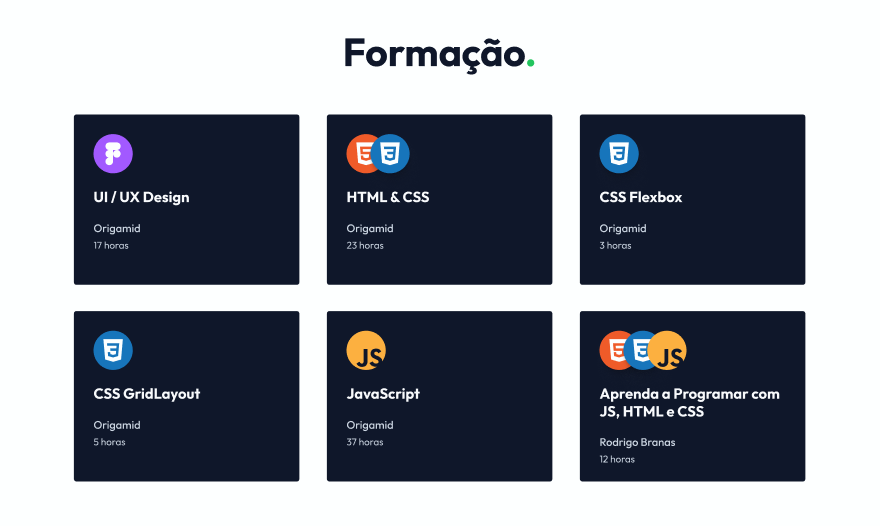

# Personal Project
<h1 align="center" style="font-weight: bold;">Portfolio 💻</h1>

 <a href="#tech">Technologies</a> • 

    <b>Portfolio containing all the information about my previous work, successfully completed courses, and contact details if you wish to get in touch with me.</b>

     <a href="PROJECT__URL">📱< Check out this project</a>

<h2 id="layout">🎨 Layout</h2>

    
    

<h2 id="technologies">💻 Technologies</h2>

- HTML
- CSS
- JAVASCRIPT
