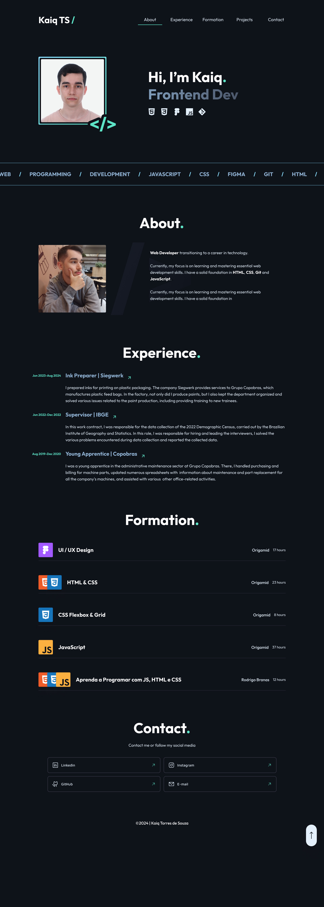

# Personal Project

<h1 align="center" style="font-weight: bold;">Portfolio 💻</h1>

 <a href="#tech">Technologies</a> • 

    <b>Portfolio containing all the information about my previous work, successfully completed courses, and contact details if you wish to get in touch with me.</b>

     <a href="PROJECT__URL">📱< Check out this project</a>

    <a href="https://www.figma.com/design/3HgFAeImct3eYxCPe4ySuF/portfolio?node-id=5-395&p=f&t=mIyK0bOOkm81b3rn-0" target="_blank" rel="noopener noreferrer">🎨 FIGMA</a>

<h2 id="layout">🎨 Layout</h2>

    

## Tech Stack

